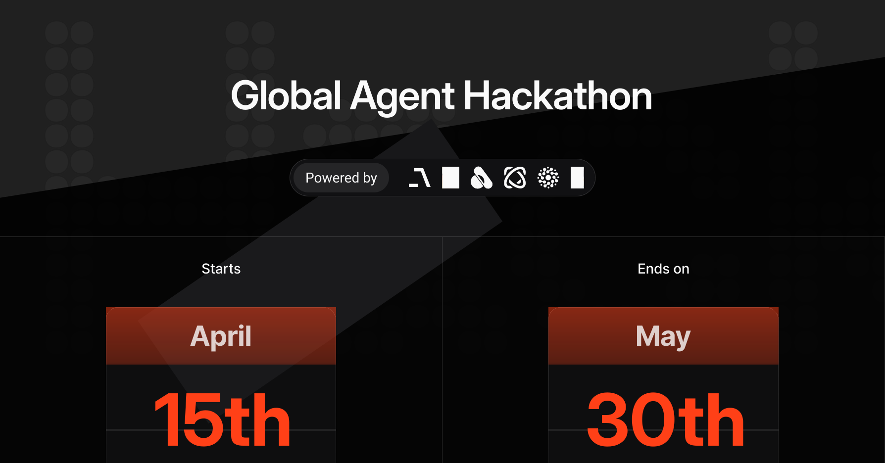

  

# 🌐 Global Agent Hackathon

Welcome to the May 2025 edition of the Global Agent Hackathon!

Join us for a month-long, open-source AI Agent Hackathon — open to all builders and dreamers working on agents, RAG, tool use, and multi-agent systems.

Powered by [Agno](https://agno.link/gh), [Firecrawl](https://www.firecrawl.dev/), [Mem0](http://mem0.ai), [Unwind AI](https://www.theunwindai.com), [Browser Use](https://browser-use.com), [Graphlit](https://www.graphlit.com/), and more.

## 💰 Build something cool, win up to $20,000 in cash and credits

We're giving away $20,000 in cash and credits for your favorite AI tools for the most ambitious Agent projects!

### Cash Prizes:

#### Best Use of Agno ([see details](/resources/agno.md)):
- 🏅 10 winners: $300 each
- 🥉 10 winners: $500 each
- 🥈 5 winners: $1,000 each
- 🥇 1 winner: $2,000
- 🏆 **GRAND PRIZE**: $5,000 🏆

#### Best use of Browser Use ([see details](/resources/browser-use.md)):
- Details coming soon

### Credits:

#### Best use of Firecrawl ([see details](/resources/firecrawl.md)):
- Details coming soon

#### Best use of Mem0 ([see details](/resources/mem0.md)):
- Details coming soon

#### Best use of Graphlit ([see details](/resources/graphlit.md)):
- Details coming soon

### Special Recognition
The **top 5 projects** will be featured in the trending [Awesome LLM Apps repo](https://github.com/Shubhamsaboo/awesome-llm-apps), giving your work massive visibility in the AI community.

## 📚 Resources

Resources for each sponsor are available in the [resources](/resources) folder.

## ⏱️ Timeline

- **April 15th** - Hackathon starts
- **May 30th** - Hackathon ends

## 🚀 How to Participate

1. **Submit your project** by creating a GitHub issue in this repo following the provided [template](./.github/ISSUE_TEMPLATE/submission-template.md).
2. **Get category assignment**
    - The Hackathon team will review your submission and assign it to a prize category:
    - You can update your issue as you build, and we'll update the prize category accordingly.
    - Prize categories can be updated until the hackathon ends.
    - Categories include Best use of Agno, Firecrawl, Mem0, Graphlit and Browser Use.
3. **Build your project** and submit a PR for in the submissions folder - we'll review, judge, and provide feedback.
4. **When approved**, you join the pool to win the assigned cash prize and/or credits.
    - Checkout the [How to Win](#how-to-win) section for more details.
5. **Winning projects** will be moved to the **winners** folder.

## 🏆 How to Win

Your submission will be judged on:

- **Completed PR** with working code in the Hackathon GitHub repo.
    - A **judge** will review the PR and provide feedback.
    - Once approved, the PR will be merged and the project will be eligible for the prize pool.
- **Demo Video** (2–3 mins) showing your agent in action.
- **Comprehensive README.md** including:
  - Overview of the idea
  - Explanation of how it works
  - Technologies/tools used
  - All setup instructions (API keys, signups, etc.)
- **Code Quality**: Error-free execution and passing basic review.
- **Completeness**: Core functionality implemented as described in your original submission.

Feel free to share your progress on X or LinkedIn with the hashtag #GlobalAgentHackathon — even small updates can get you noticed and help build community momentum. This is completely optional, but always welcome and appreciated!

## 📌 Submission Criteria

Include the following in your submission:

**Project Title:** A clear, concise, and engaging title for your project.

**Overview of the Idea:** Briefly describe your project in simple terms. What problem or opportunity does it address?

**Project Goal:** What do you hope to achieve or demonstrate with this project?

**How It Works:** Provide a step-by-step explanation or high-level breakdown of your Agentic System and how users will interact with it:
- **User Flow**: Clearly describe the experience from the user's perspective
- **Core Functionality**: List the key features your agent will offer
- **Multimodal Elements** (if applicable): Specify if you're using text, images, audio, video, or combinations

**Tools Used:** List what you're planning to use, including any new tools you need to create.

**UI Approach:** Describe the user interface for your project.

**Visuals:** Add mockups, diagrams, or sketches that demonstrate your idea or flow.

**Team Information:**
- **Team Lead:** GitHub handle and role
- **Team Members:** GitHub handles and roles
- **Background/Experience:** Brief team background

## 🤝 Want to Partner?

If you're an AI company and want to help shape the next generation of Agent builders - we'd love to work with you!

Reach out to support@agno.com to get involved.

Let's make this the largest open-source AI Agent hackathon ever!

**See you in the arena.**
